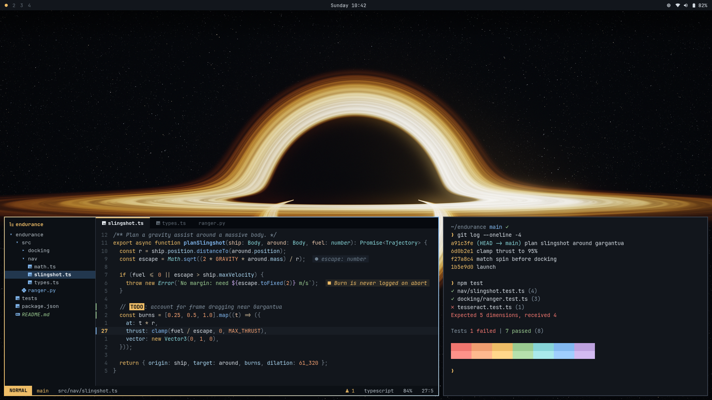
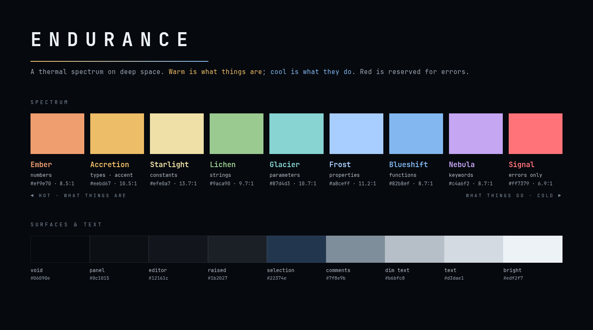

# Endurance

**v0.2.0** · [Changelog](CHANGELOG.md)



A deep-space engineering theme for [Omarchy](https://omarchy.org/), built for
long sessions and live lectures. Inspired by *Interstellar*: blue-black space,
amber light from something vast and hot, and nothing on screen that is not
doing a job.

## Install

Omarchy menu (`Super + Space`) → **Install → Style → Theme**, paste the git URL
of this repository. Or:

```sh
omarchy theme install https://github.com/philsinatra/omarchy-endurance-theme.git
```

That's all. Like every Omarchy theme, Endurance is one `colors.toml`, and
Omarchy generates Neovim, VS Code, Helix, the terminals, btop, Chromium,
Hyprland and the shell from it.

## A thermal spectrum

The palette is one idea: syntax colours are laid out like temperature — a
Doppler shift across the code. **Warm is what things are**: types and literal
values. **Cool is what things do** and are called: functions, parameters,
properties. Keywords sit apart in nebula violet.

| | Colour | Hex | Carries |
| --- | --- | --- | --- |
| **hot** | Ember | `#ef9e70` | numbers, booleans |
| | Accretion amber | `#eebd67` | types, classes — and the theme accent |
| | Starlight | `#efe0a7` | constants |
| **cold** | Lichen | `#9aca90` | strings |
| | Glacier | `#87d4d3` | parameters, fields |
| | Frost | `#a8ceff` | properties |
| | Blueshift | `#82b8ef` | functions |
| **apart** | Nebula | `#c4a6f2` | keywords — the language itself |
| **signal** | Red | `#ff7379` | errors |

Every colour is picked for the role Omarchy's templates give its slot, so
Neovim and VS Code read the same way with no editor-specific files.



### Measured, not eyeballed

The palette is generated in OKLCH by `scripts/genpalette.py`, which refuses to
write unless every constraint holds:

| Check | Target | Endurance |
| --- | --- | --- |
| body text on background | ≥ 11:1 | **12.9:1** |
| comments | ≥ 4.8:1 | **5.4:1** |
| syntax colours | — | 6.9 – 13.7:1 |
| closest pair of syntax roles (OKLab ΔE) | ≥ 0.07 | **0.078** |
| every colour inside sRGB | yes | yes |

The distance check is the one that matters on a projector: no two roles a
student has to tell apart — keyword, type, constant, number, string, parameter,
property, function, error, plain variable — are allowed to collapse into each
other. Comments stay readable at the back of a lecture hall.

## Backgrounds

Four frames that follow the film's arc — from the end of the voyage back home.

| File | Subject | Size | Mean |
| --- | --- | --- | --- |
| `1-gargantua.jpg` | A black hole and its disk, **ray-traced for this theme** | 5120×2880 | 12% |
| `2-event-horizon.webp` | The theme gradient: deep space, amber light from off-frame | 3840×2160 | 9% |
| `3-saturn.jpg` | Saturn eclipsing the Sun — Cassini, *The Day the Earth Smiled* | 5120×2880 | 13% |
| `4-crescent-earth.jpg` | A thin crescent Earth from lunar distance — Artemis II | 5120×2880 | 4% |

Every frame keeps its top edge dark (top 8% under 5% mean luminance), so the
status bar always has contrast. `1-gargantua.jpg` is real physics, not a
painting: light rays traced through Schwarzschild spacetime into a thin disk —
see `scripts/blackhole.py`. Credits and licences:
[`backgrounds/CREDITS.md`](backgrounds/CREDITS.md). Cycle them with
`omarchy theme bg next`.

## What is shipped

| File | Purpose |
| --- | --- |
| `colors.toml` | The theme. Omarchy generates every app's config from it |
| `btop.theme` | Omarchy's btop template with red kept for alarms only (generated) |
| `icons.theme` | `Yaru-yellow` |
| `keyboard.rgb` | Accretion amber for RGB keyboards |
| `backgrounds/` | Four frames — see [`backgrounds/CREDITS.md`](backgrounds/CREDITS.md) |
| `preview.webp`, `docs-palette.webp` | Theme picker thumbnail, palette card |
| `unlock.png`, `preview-unlock.png` | Boot / disk-unlock (Plymouth) wordmark and its preview |
| `scripts/genpalette.py` | OKLCH constants → `colors.toml` and `btop.theme`, with the contrast and separation checks |
| `scripts/oklch.py` | OKLCH ↔ sRGB, WCAG contrast, OKLab distance; no dependencies |
| `scripts/gradient.py` | Renders `2-event-horizon.webp` (numpy, Pillow) |
| `scripts/blackhole.py`, `scripts/blackhole_post.py` | Ray-traces and tone-maps `1-gargantua.jpg` (numpy, Pillow) |

## Design rules

1. Colour is information. Each hue has one job, and a student can learn them
   all in a minute.
2. Warm is what things are, cool is what they do. Red is kept for errors; the
   terminal and btop never use it for decoration.
3. Harmony is enforced numerically: a minimum perceptual distance between
   roles, contrast floors for text and comments, and a generator that refuses
   to write a palette that breaks any of it.
4. The chassis is deep space: one cool hue at near-zero chroma, so code is the
   brightest thing on screen.
5. One file installs everything. No editor-specific code, nothing Omarchy has to
   drop from a git install.
6. Backgrounds are single-subject, never upscaled, dark at the top edge, and
   good enough to sell the theme on their own.

## License

Theme files, the ray-traced black hole and the gradient are MIT — see
[`LICENSE`](LICENSE). The Saturn and Earth photographs are NASA imagery in the
public domain; see [`backgrounds/CREDITS.md`](backgrounds/CREDITS.md). Endurance
is not affiliated with NASA or with the film *Interstellar*.
